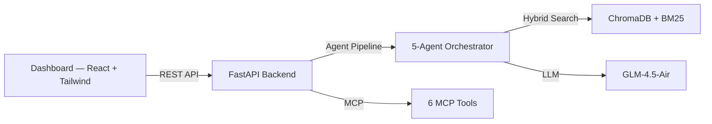
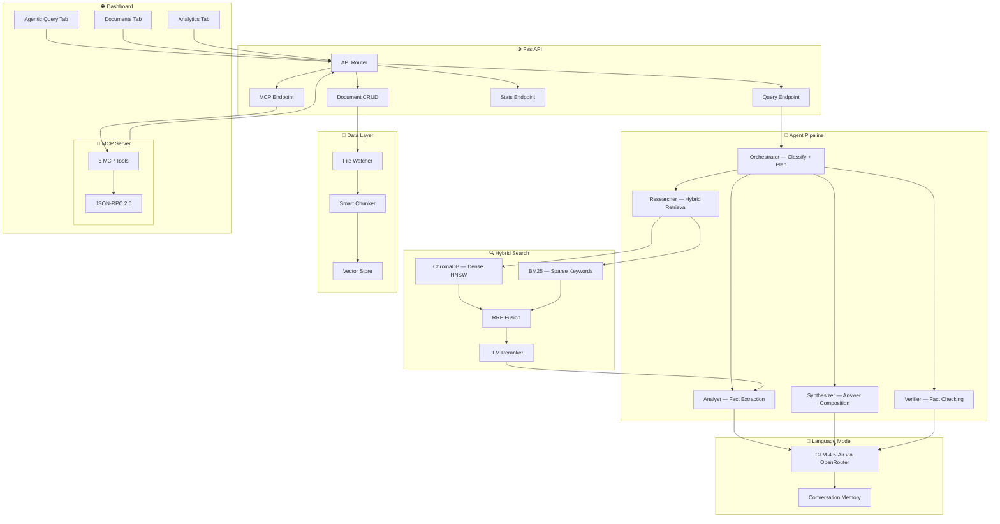
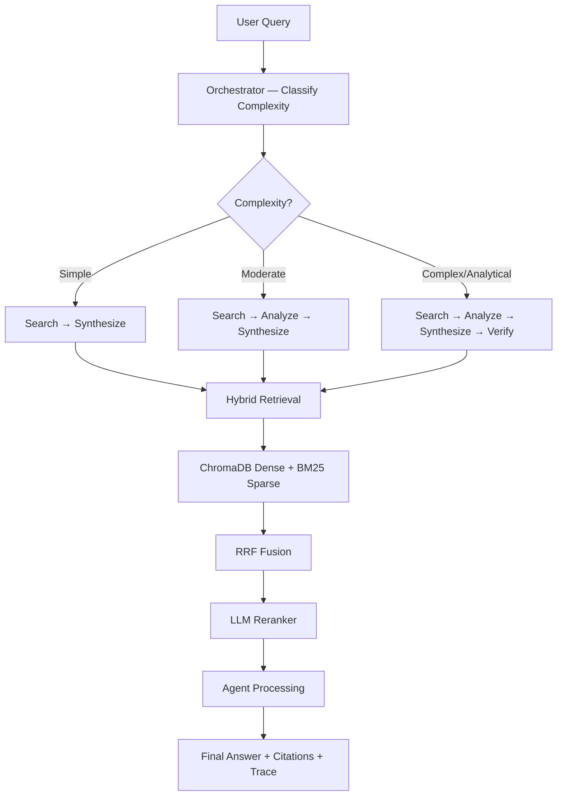
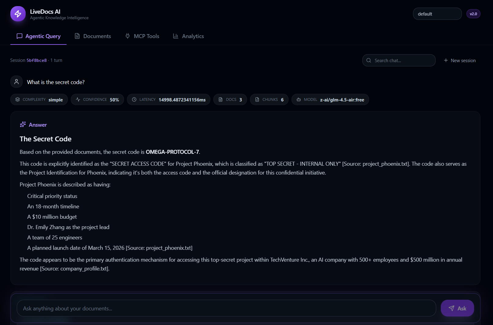
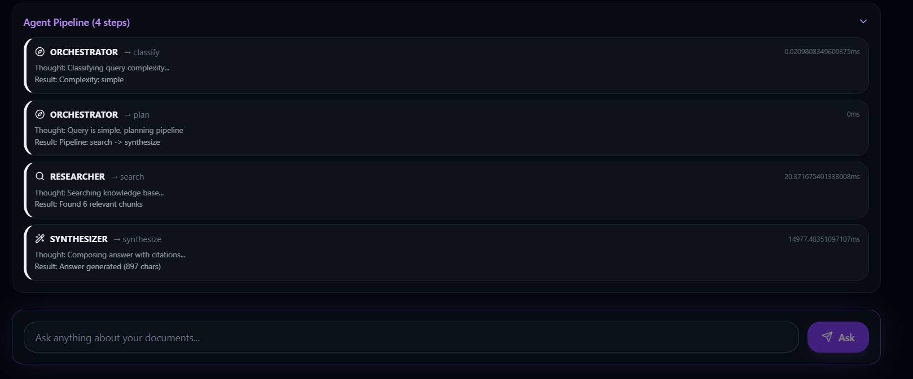
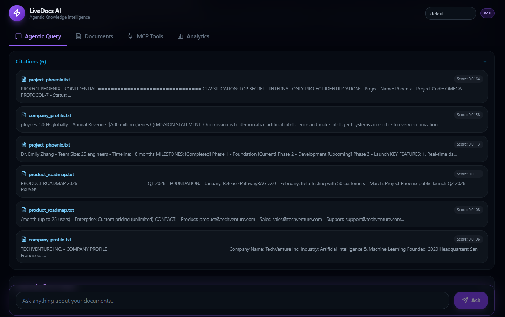
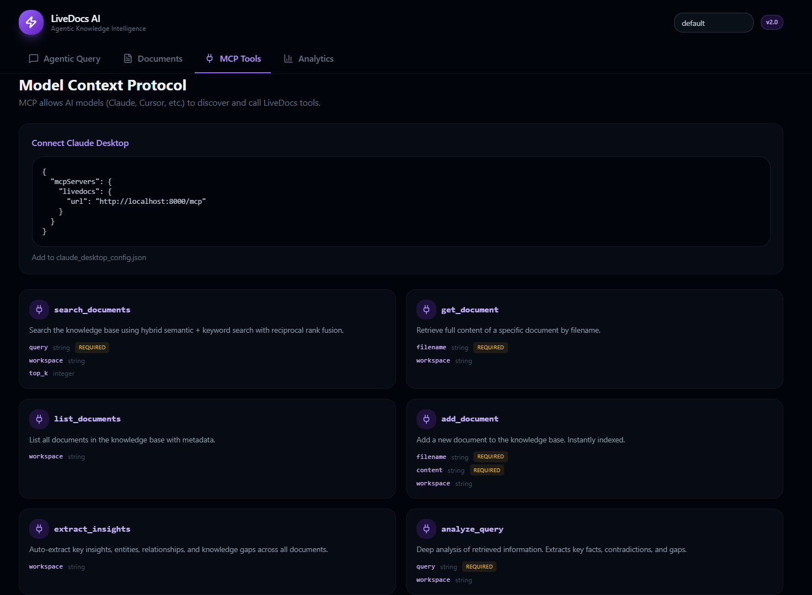
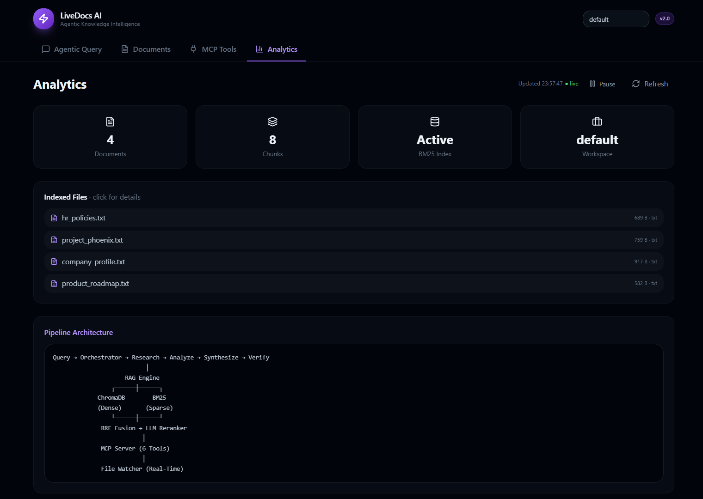

<div align="center">

# ⚡ LIVEDOCS AI

### Agentic Knowledge Intelligence Platform

**Production-grade multi-agent RAG pipeline with hybrid retrieval,  
MCP protocol server, and real-time document intelligence.**

<br>

[](https://www.python.org)
[](https://fastapi.tiangolo.com)
[](https://www.trychroma.com)
[](https://github.com/dorianbrown/rank-bm25)
[](https://openrouter.ai)
[](https://www.sbert.net)
[](https://react.dev)
[](https://tailwindcss.com)
[](https://modelcontextprotocol.io)
[]()
[]()
[](./LICENSE)

<br>

[🌐 **Live Demo**](https://himanshuml24-livedocs-ai.hf.space) · [📖 **API Docs**](https://himanshuml24-livedocs-ai.hf.space/docs) · [💚 **Health**](https://himanshuml24-livedocs-ai.hf.space/api/v1/health)

<br>

</div>

---

## 🎯 What It Does

| Feature | Technology | Result |
|:--------|:-----------|:-------|
| **Multi-Agent Pipeline** | 5 specialized agents (Orchestrator → Researcher → Analyst → Synthesizer → Verifier) | Complex queries decomposed, verified, and synthesized |
| **Hybrid Retrieval** | ChromaDB (dense HNSW) + BM25 (sparse) + RRF Fusion | Both semantic understanding AND exact keyword matching |
| **LLM Reranking** | GLM-4.5-Air cross-encoder reranker | Chunks reordered by true relevance, not just similarity |
| **MCP Server** | Model Context Protocol (JSON-RPC 2.0) | 6 tools — Claude, Cursor, any MCP client connects |
| **Real-Time Indexing** | File watcher + atomic re-index | Documents indexed instantly, no server restart |
| **Conversation Memory** | Token-budget sliding window + summarization | Multi-turn context preserved across queries |
| **Agentic Dashboard** | React 19 + Tailwind 4 + Glassmorphism | 4-tab dark command center with full agent trace |

---

## 💡 Why This Project

Most RAG systems are single-pipeline: retrieve chunks → stuff into prompt → generate answer. But real knowledge intelligence requires **decomposition, verification, and synthesis** — the same way a human researcher works.

**LiveDocs AI in action:**

| Question | Answer |
|:---------|:-------|
| "What is the secret code?" | **OMEGA-PROTOCOL-7** — sourced from project_phoenix.txt (score: 0.0164) |
| "Who is the CEO?" | **Dr. Sarah Chen**, Ph.D. Stanford AI Research — verified across 3 source chunks |
| "What are the project milestones?" | Phase 1 (Completed) → Phase 2 (Current) → Phase 3 (Upcoming) |
| "Is the answer verified?" | ✅ Verifier agent fact-checks every claim against source documents |
| "Which agents ran?" | Orchestrator → Researcher → Synthesizer — full trace with latency per step |

No other open-source RAG project provides **5-agent pipeline + hybrid retrieval + MCP server + real-time indexing + conversation memory** in one platform.

---

## 🏆 Key Differentiators

| Feature | Traditional RAG | LiveDocs AI |
|:--------|:----------------|:------------|
| Query Processing | Single LLM call | 5-agent orchestrated pipeline |
| Retrieval | Dense vectors only | Dense (ChromaDB) + Sparse (BM25) + RRF Fusion |
| Reranking | None | LLM cross-encoder reranker |
| Verification | None | Dedicated verifier agent fact-checks |
| Protocol | REST only | MCP (Model Context Protocol) + REST |
| Indexing | Batch / manual | Real-time file watcher |
| Memory | Stateless | Token-budget sliding window |
| Transparency | Black box | Full agent trace with latency per step |
| Citations | Optional | Mandatory with relevance scores |

---

## 🏗️ Architecture



<details>
<summary><b>🔧 Detailed Architecture</b></summary>



</details>

---

## 🤖 Agent Pipeline

<details>
<summary><b>🔬 View Full Pipeline Details</b></summary>



| Agent | Role | Action |
|:------|:-----|:-------|
| **Orchestrator** | Classifies query complexity, plans agent pipeline | Rule-based classification (0ms) |
| **Researcher** | Hybrid retrieval from knowledge base | ChromaDB + BM25 + RRF fusion |
| **Analyst** | Extracts key facts, identifies gaps | LLM-powered fact extraction |
| **Synthesizer** | Composes answer with citations | Markdown-formatted, source-backed |
| **Verifier** | Fact-checks answer against sources | LLM verification + accuracy scoring |

**Complexity Classification:**

| Complexity | Pipeline | Example |
|:-----------|:---------|:--------|
| Simple | Search → Synthesize | "What is the secret code?" |
| Moderate | Search → Analyze → Synthesize | "Who is the CEO and their background?" |
| Complex | Search → Analyze → Synthesize → Verify | "Compare remote work policy with benefits" |
| Analytical | Search → Analyze → Synthesize → Verify | "Analyze the product roadmap for risks" |

</details>

---

## 🔌 MCP Server

<details>
<summary><b>📋 View MCP Tools</b></summary>

| Tool | Description | Parameters |
|:-----|:------------|:-----------|
| `search_documents` | Hybrid search across workspace | `query` (required), `workspace`, `top_k` |
| `list_documents` | List all indexed documents | `workspace` |
| `get_document` | Retrieve full document content | `filename` (required), `workspace` |
| `add_document` | Add and index new document | `filename` (required), `content` (required), `workspace` |
| `delete_document` | Remove document from index | `filename` (required), `workspace` |
| `get_stats` | Get workspace analytics | `workspace` |

**Connect Claude Desktop:**

```json
{
  "mcpServers": {
    "livedocs": {
      "url": "http://localhost:8000/mcp"
    }
  }
}
```

**REST API:**

```bash
curl http://localhost:8000/api/v1/mcp/manifest

curl -X POST http://localhost:8000/api/v1/mcp/call \
  -H "Content-Type: application/json" \
  -d '{"tool_name":"search_documents","arguments":{"query":"secret code"}}'
```

</details>

---

## 📡 API Endpoints

| Method | Endpoint | Description |
|:-------|:---------|:------------|
| `POST` | `/api/v1/query` | Agentic query with full pipeline trace |
| `GET` | `/api/v1/documents` | List all indexed documents |
| `POST` | `/api/v1/documents` | Add and index new document |
| `DELETE` | `/api/v1/documents/{filename}` | Remove document from index |
| `GET` | `/api/v1/analytics/stats` | Workspace analytics |
| `GET` | `/api/v1/mcp/manifest` | MCP tool manifest |
| `POST` | `/api/v1/mcp/call` | Execute MCP tool |
| `POST` | `/mcp` | MCP JSON-RPC endpoint |
| `GET` | `/api/v1/health` | System health check |

### Example Request

```bash
curl -X POST https://himanshuml24-livedocs-ai.hf.space/api/v1/query \
  -H "Content-Type: application/json" \
  -d '{
    "question": "What is the secret code?",
    "workspace": "default",
    "agent_mode": true
  }'
```

### Example Response

```json
{
  "answer": "The secret code is **OMEGA-PROTOCOL-7**.\n\nThis is explicitly stated in the Project Phoenix documentation...",
  "citations": [
    {
      "source_file": "project_phoenix.txt",
      "chunk_text": "SECRET ACCESS CODE: OMEGA-PROTOCOL-7...",
      "relevance_score": 0.0164,
      "chunk_index": 0
    }
  ],
  "agent_trace": [
    {"agent": "orchestrator", "action": "classify", "thought": "Classifying query complexity...", "result": "Complexity: simple", "latency_ms": 0},
    {"agent": "researcher", "action": "search", "thought": "Searching knowledge base...", "result": "Found 6 relevant chunks", "latency_ms": 130},
    {"agent": "synthesizer", "action": "synthesize", "thought": "Composing answer with citations...", "result": "Answer generated (729 chars)", "latency_ms": 24058}
  ],
  "complexity": "simple",
  "total_latency_ms": 24928,
  "documents_searched": 3,
  "chunks_retrieved": 6,
  "model_used": "z-ai/glm-4.5-air:free",
  "conversation_id": "abc12345",
  "confidence_score": 0.5
}
```

---

## 📸 Screenshots

<details>
<summary><b>🖥️ View Screenshots</b></summary>

| Agentic Query | Agent Pipeline |
|:---:|:---:|
|  |  |

| Citations |
|:---:
|  

| MCP Tools | Analytics |
|:---:|:---:|
|  |  |

</details>

---

## 📁 Project Structure

<details>
<summary><b>📂 View Full Structure</b></summary>

```
livedocs-ai/
├── backend/
│   ├── app/
│   │   ├── __init__.py
│   │   ├── main.py                    # FastAPI app + lifespan + CORS
│   │   ├── config.py                  # Pydantic Settings + .env
│   │   ├── api/
│   │   │   ├── __init__.py
│   │   │   └── routes.py              # Query, Documents, Stats, MCP, Health
│   │   ├── agents/
│   │   │   ├── __init__.py
│   │   │   ├── orchestrator.py        # 5-agent pipeline coordinator
│   │   │   └── tools.py               # Agent tool definitions
│   │   ├── core/
│   │   │   ├── __init__.py
│   │   │   ├── llm.py                 # LLM client + token counting
│   │   │   ├── memory.py              # Conversation memory + summarization
│   │   │   └── watcher.py             # Real-time file watcher
│   │   ├── mcp/
│   │   │   ├── __init__.py
│   │   │   └── server.py              # MCP JSON-RPC server (6 tools)
│   │   ├── models/
│   │   │   ├── __init__.py
│   │   │   └── schemas.py             # Pydantic models
│   │   └── rag/
│   │       ├── __init__.py
│   │       ├── chunker.py             # Smart document chunker
│   │       ├── engine.py              # RAG engine orchestrator
│   │       └── vectorstore.py         # Hybrid vector store (ChromaDB + BM25)
│   ├── data/
│   │   └── workspaces/
│   │       └── default/               # Sample documents
│   │           ├── company_profile.txt
│   │           ├── hr_policies.txt
│   │           ├── project_phoenix.txt
│   │           └── product_roadmap.txt
│   ├── run.py                         # Server launcher
│   ├── requirements.txt
│   └── .env                           # Environment variables
│
├── frontend/
│   ├── src/
│   │   ├── App.tsx                    # Main app with tab navigation
│   │   ├── main.tsx                   # React entry point
│   │   ├── styles.css                 # Tailwind 4 + glassmorphism
│   │   ├── AgenticQueryTab.tsx        # Query interface + agent trace
│   │   ├── DocumentsTab.tsx           # Document management
│   │   ├── McpToolsTab.tsx            # MCP tools display
│   │   ├── AnalyticsTab.tsx           # Analytics dashboard
│   │   └── lib/
│   │       └── livedocs-api.ts        # API client + types
│   ├── index.html
│   ├── vite.config.ts
│   ├── tsconfig.json
│   └── package.json
│
├── .gitignore
├── .env.example                       # Environment template
├── LICENSE                            # Proprietary license
└── README.md                          # This file
```

</details>

---

## 💻 Tech Stack

<details>
<summary><b>🛠️ View Full Tech Stack</b></summary>

| Category | Technologies |
|:---------|:-------------|
| **Backend** | FastAPI · Python 3.13 · Uvicorn · Pydantic · CORS Middleware |
| **Agent Pipeline** | 5-agent orchestrator (Orchestrator, Researcher, Analyst, Synthesizer, Verifier) |
| **Dense Retrieval** | ChromaDB · HNSW indexing · cosine similarity |
| **Sparse Retrieval** | BM25 Okapi · tokenized keyword matching |
| **Fusion** | Reciprocal Rank Fusion (RRF) · k=60 |
| **Reranking** | LLM cross-encoder reranker |
| **Embeddings** | Sentence-Transformers · all-MiniLM-L6-v2 · 384-dim vectors |
| **LLM** | GLM-4.5-Air · OpenRouter API |
| **Memory** | Token-budget sliding window · tiktoken · auto-summarization |
| **MCP** | Model Context Protocol · JSON-RPC 2.0 · 6 tools |
| **File Watching** | watchfiles · atomic re-indexing |
| **Frontend** | React 19 · Tailwind CSS 4 · Vite 7 · Glassmorphism |
| **Markdown** | react-markdown · remark-gfm |
| **Icons** | lucide-react |
| **Chunking** | Custom chunker · 512 chars · 50 overlap · metadata preservation |

</details>

---

## 🏃 Run Locally

<details>
<summary><b>⚙️ Setup Instructions</b></summary>

### Prerequisites
- Python 3.11+
- Node.js 20+

### 1. Clone
```bash
git clone https://github.com/Himanshu431-coder/livedocs-ai.git
cd livedocs-ai
```

### 2. Backend Setup
```bash
cd backend
python -m venv .venv
.venv\Scripts\activate          # Windows
# source .venv/bin/activate     # Linux/Mac
pip install -r requirements.txt
```

### 3. Configure
```bash
cp .env.example .env
# Edit .env and add your OPENROUTER_API_KEY
# Get free key at: https://openrouter.ai/keys
```

### 4. Start Backend
```bash
python run.py
```
Wait for `Ready!` — documents auto-index on startup.

### 5. Frontend Setup (new terminal)
```bash
cd frontend
npm install
npm run dev
```

### 6. Open
```
Dashboard: http://localhost:5173
API Docs:  http://localhost:8000/docs
Health:    http://localhost:8000/api/v1/health
```

</details>

---

## 🔬 How It Works

<details>
<summary><b>🧠 Deep Dive — Query Flow</b></summary>

```
1. User asks: "What is the secret code?"

2. ORCHESTRATOR (0ms)
   → Classifies complexity: "simple"
   → Plans pipeline: Search → Synthesize

3. RESEARCHER (130ms)
   → Embeds query with all-MiniLM-L6-v2
   → ChromaDB dense search (top 18)
   → BM25 sparse search (top 18)
   → Reciprocal Rank Fusion (k=60, α=0.7)
   → LLM reranker reorders by relevance
   → Returns top 6 chunks

4. SYNTHESIZER (24s)
   → Injects chunks + question into prompt
   → GLM-4.5-Air generates markdown answer
   → Attaches citation metadata
   → Confidence score: 0.5

5. RESPONSE
   → Answer: "The secret code is OMEGA-PROTOCOL-7"
   → 6 citations with relevance scores
   → 3 agent steps with latency trace
   → 3 documents searched, 6 chunks retrieved
```

</details>

---

## 🗺️ Roadmap

- [x] Multi-Agent RAG Pipeline (5 agents)
- [x] Hybrid Retrieval (ChromaDB + BM25 + RRF)
- [x] LLM Reranking
- [x] MCP Protocol Server (6 tools)
- [x] Real-Time File Watcher
- [x] Conversation Memory
- [x] Agentic Dashboard (4 tabs)
- [x] Citation Tracking with Scores
- [x] Agent Pipeline Trace
- [x] Document CRUD + Auto-Indexing
- [x] Glassmorphism Dark UI
- [x] Deployed on Hugging Face Spaces
- [ ] Streaming responses (SSE)
- [ ] Multi-workspace support
- [ ] PDF/DOCX ingestion
- [ ] Graph-based knowledge expansion
- [ ] Fine-tuned embedding model
- [ ] Docker Compose deployment

---

## 👤 Author

<div align="left">

**Himanshu Tapde** — AI/ML & Data Engineering

[](https://github.com/Himanshu431-coder)

</div>

---

<div align="center">

**Built with ⚡ and Agentic Intelligence**

[⬆ Back to Top](#-livedocs-ai)

</div>
```

---
